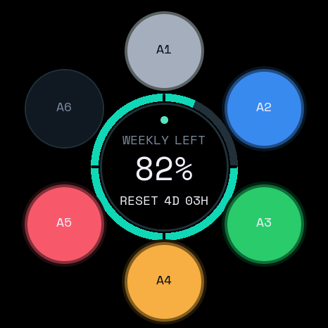
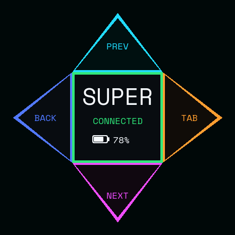
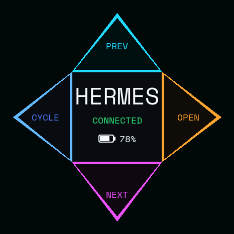

# Stopwatch AgentBezel C152

[English](README.md)

**Stopwatch AgentBezel C152** 是面向 **M5Stack StopWatch Dev Kit C152**
的独立、非官方开源三工作区控制界面：Codex Micro 兼容面板、super.engineering
项目控制、Hermes Desktop 会话控制，并提供本地额度面板和可选 USB 麦克风。

Codex Micro 兼容性为实验性且未文档化功能。运行标识、配对身份、音频名称与
Companion 身份保持不变。三应用行为需要匹配的源码构建；源码版本 `5e9cc25`
已完成约定的 USB-mic C152 实机验收，详见
[验收结果与边界](docs/superpowers/plans/2026-09-04-hermes-open-physical-acceptance.md)。
这是一套本地环境的验证，不代表保证所有应用版本兼容。

## 三工作区

<table>
  <tr><th>Codex Micro</th><th>super.engineering</th><th>Hermes Desktop</th></tr>
  <tr>
    <td width="33%"></td>
    <td width="33%"></td>
    <td width="33%"></td>
  </tr>
</table>

以上是 native framebuffer 设计预览，不是真机照片。

**左滑循环：Codex / ChatGPT → SUPER → HERMES → Codex / ChatGPT。**
当前 Codex / ChatGPT 入口使用 `com.openai.codex`，只算一个目标，不拆成两个。
其他应用在前台时，左滑先进入 Codex。找不到或无法激活的目标不会被自动跳过。
原来的“返回之前应用”已被固定循环替代。

| 输入 | Codex Micro | SUPER | HERMES |
| --- | --- | --- | --- |
| 左实体键 / 右实体键 / 中心短点 | Push to talk / Voice Chat / Send | 无动作¹ | 无动作¹ |
| 左滑 | 进入 SUPER | 进入 HERMES | 进入 Codex |
| 上滑 | 应用现有映射 | 上一个项目 | 浏览上一个会话 |
| 下滑 | 应用现有映射 | 下一个项目 | 浏览下一个会话 |
| 右滑 | 应用现有映射 | 下一个会话 Tab | 打开高亮会话 |
| 电源操作 | 桌面休眠 / 旅行关机 | 相同 | 相同 |

¹ 专属屏幕和设备侧隔离需要用户明确选择、且匹配的 `usb-mic` 固件。
默认无线固件仍显示 Codex 面板；Companion 方向控制仅在真实 `--watch` 中启用。

## Codex Micro 工作区

默认仪表盘显示 Agent 状态、本周 Codex 剩余额度、reset 倒计时、电量和
充电/Dock 状态，以及 Codex、BLE 和额度同步是否健康。Agent 完成时会变绿并
播放柔和提示音。左侧实体键是 Push to talk，右键是 Voice Chat，中央圆盘是
Send，上/下/右仍在 ChatGPT Desktop 中配置，Companion 真实 watch 模式下左滑用于工作区循环；实体键和触摸手势均有
振动反馈。

正常中心圆采用四行均衡布局：连接状态、剩余额度、重置倒计时、电量。
删除冗余的 `WEEKLY LEFT` 标签；异常状态仍保留 `SYNC STALE`、`WAITING CODEX`
等诊断提示。

兼容的 `Codex Micro` BLE HID 通道负责控制；本地额度 companion 使用独立的
项目自有 BLE GATT 服务，因此手表不会保存 OpenAI token。开发时使用的
ChatGPT Desktop 仅暴露一个 Mic key，而非单独的 `ACT10` 和 `ACT11`：
右键有意发送可配置的 `ACT09`（`Command Key 4`），不是 `ACT11`。

电池供电时，屏幕两分钟后变暗、五分钟后进入桌面休眠；Dock Mode 分别延长到
十和三十分钟。桌面休眠保持 BLE 提醒在线。双击红色电源键执行经固件确认的
旅行模式关机，按电源键或接入 USB 即可唤醒；长按中央六秒是带未接收提醒警告的
较慢旅行模式兜底。物理电源切换的 soak 测试仍待完成，因此时间和唤醒行为在
清单完成前均为实验性。

## super.engineering 工作区

仅匹配 `com.zarifpour.superconductor`。在应用快捷键中配置：
Previous Project = `Control-Option-Up`、Next Project = `Control-Option-Down`、
Next Tab = `Control-Option-Right`。上/下/右仅定向发送给该前台进程。
左滑进入 Hermes，不再返回任意旧应用。

## Hermes Desktop 工作区

仅匹配原生桌面应用 `com.nousresearch.hermes`，不是 CLI、网页面板或安装器。
上滑发送 `Control-Shift-Tab`，下滑发送 `Control-Tab`，保留
[原生桌面浏览快捷键](https://hermes-agent.nousresearch.com/docs/user-guide/desktop#windows-tabs--panes)。
屏幕中央会话选择器出现时，上下选择、右滑打开高亮会话。右滑发送一次
Control 按下/松开，结束时清除修饰键标记；已用物理键盘确认 Hermes 0.17.0
选择器在 Control 松开时确认。右滑不发送 Enter 或 Command-T，不再新建 Tab。
安装前请核验你的 Hermes 版本；原生浏览受聚焦 Tab 区域影响，并不保证按
Project 树排序。无需 Hermes 插件或源码扩展。Companion 不检测选择器状态，
不读取会话数据或应用设置，也不自动重试确认。本次安装已分别确认物理键盘行为
和手表上下浏览、右滑打开；重复右滑及无选择器时右滑均未新建会话、发送草稿或
造成 Control 卡键。更新 Hermes 版本后请重新验收。

## 共用配置与屏幕行为

1. 安装三个目标桌面应用。需要独立 Space 时，人工使用
   **Dock → Options → Assign To → This Desktop** 分配。
   Companion 仅激活应用，不创建/枚举 Space，也不选择具体窗口。
2. 为 `CodexWatchCompanion.app` 开启输入监控、辅助功能，并保留额度同步所需的蓝牙权限。
3. ChatGPT 控制器的 **Analog stick left** 保持未绑定，上/下/右保留现有映射。
   权限变更后重启原 Companion LaunchAgent。
4. 在源码验证、备份及当次准确端口刷写确认后，再安装匹配的 Companion 和明确选择的 USB-mic 固件。

SUPER/HERMES 使用四个向外三角形，不绘制独立中心方框。电池图标与百分比作为
整体居中显示在标题和连接状态下方，也覆盖未知电量和三位数百分比。每次本地有效滑动从
12 色池中抽取四种不同边框颜色，每个方向不沿用自己的上一次颜色，文字色保持稳定。
配色反馈独立执行 800ms 冷却；重绘、心跳、额度变化和 Dock/Command-Tab 切换不换色。
换色只是本地输入反馈，不证明 Mac 快捷键执行成功。

屏幕跟随真实前台，心跳 5 秒、连接所有者租约 15 秒。离开两个方向桌面时发送 Codex；
失败时最多再间隔 5 秒重试两次，租约过期或所有者断开则恢复 Codex。
前台变化不唤醒屏幕；禁用短点和实体控制也不唤醒方向桌面，真实滑动可以唤醒，
但该次唤醒滑动不同时执行看不见的操作。中央长按及红色电源行为保留。

SUPER/HERMES 隔离 Agent、Send、ChatGPT 麦克风/语音按键；模式切换释放已按住的控制，
不补发过期完成提示，USB 麦克风端点持续可用。
MainActor 路由在发送前校验前台 PID/bundle，只投递固定的进程定向按键，
不使用全局键盘注入，不读取应用内容。

### 验证状态与新安装检查

[实机验收记录](docs/superpowers/plans/2026-09-04-hermes-open-physical-acceptance.md)
区分用户观察到的界面、操作和录音结果，以及刷写、运行日志和构建证据。
本次环境已通过约定的浏览/打开、三桌面、输入隔离、熄屏、租约回退、重连、麦克风
和额度检查。开发机的 Command Line Tools 缺少 XCTest，完整 XCTest 仍不可执行；
Swift harness 不等于完整 XCTest。

每套新安装仍需确认完整左滑循环、未启动应用启动、失败不跳过、Space、各方向动作、防重复、
随机色、熄屏唤醒、输入隔离、ChatGPT 无后台误动作、15 秒回退、断开重连、
USB 麦克风短采集、额度及原自动启动。构建和 native 预览不等于 C152 实机通过。

## 推荐安装方式

这是源码构建项目，不分发预编译 macOS App、DMG 或 PKG。推荐在将与 C152 配对的
支持蓝牙的 Mac 上，用 Codex 在本地打开本仓库。它需要 macOS 14+、Swift 5.10+
（Xcode 15.3 Command Line Tools+）、PlatformIO Core、首次刷机所需的数据
USB-C 线，以及已登录且支持 Codex Micro 的 ChatGPT Desktop。本移植只支持
**M5Stack StopWatch Dev Kit，SKU C152**，不支持其他 M5Stack 设备。

连接 C152，切勿猜测串口，并把以下内容粘贴给 Codex：

```text
请帮我把这个项目安装到真实的 M5Stack StopWatch Dev Kit C152 上。

开始前完整阅读 AGENTS.md 和 README.zh-CN.md。请自主完成安装流程，但严格遵守：

1. 先做只读检查，确认 macOS、C152 硬件、现有构建工具，以及刚刚接入的准确串口。
2. 不要构建或启用麦克风、USB Audio、BLE Audio、diagnostics 或其他暂缓实验；
   只使用 m5stack-stopwatch 固件环境。
3. 安装任何缺失依赖之前先向我解释。不要向我索要 OpenAI API key、登录 cookie、
   access token 或其他凭据。
4. 先向我展示 M5Stack 官方恢复出厂固件链接，再完成固件编译。
5. 刷机前再次解析并报告准确的 /dev/cu.* 端口，只针对这一次设备写入征求确认。
6. 刷机后使用 `python3 scripts/serial_probe.py <准确端口> --seconds 30 --expect
   CODEX_MICRO_STOPWATCH_READY` 验证启动标记，再引导我完成 macOS 蓝牙配对。
7. 帮我给 ChatGPT 开启输入监控，并配置 ChatGPT Desktop：左键 = Push to talk，
   Command Key 4 = Toggle voice chat，中间 = Send；上/下/右保留可配置，左方向留空供 watch 模式循环。
8. 从源码编译 Swift 额度 companion。先用 demo discovery 找出这台 Mac 看到的
   CoreBluetooth UUID，再把真实额度写入绑定到这一台设备。
9. 如果我同意开机自动运行，只在本机生成 app wrapper 和 LaunchAgent。路径、UUID、
   日志和生成的 app 都不能进入 Git。
10. 分别验证两个实体键、中央 Send、四向滑动、Agent 颜色、完成提示音、振动、
    真实额度和 reset 更新。没有在真机观察到的结果必须明确标成未验证。
11. 只有在我明确选择可选 SUPER/HERMES 阶段时，才引导我进行 Space、快捷键
    和验收配置。不要静默开启辅助功能、修改 super.engineering 设置或分配 Space。
12. 除非我明确选择该独立阶段，不要选择或刷入可选 USB 麦克风镜像。
```

仓库中的 [AGENTS.md](AGENTS.md) 为安装和隐私提供持续生效的边界。Claude Code
和其他本地 coding agent 也可以遵循同一说明，但本项目文档默认使用 Codex。

## macOS 权限与应用配置

Codex 负责终端工作；用户仍需确认缺失工具和准确刷机操作，在 **系统设置 >
蓝牙** 中配对 **Codex Micro**，并在 **系统设置 > 隐私与安全性 > 输入监控** 中
允许 **ChatGPT**，随后退出并重新打开 ChatGPT。请在 **ChatGPT Desktop >
Settings > Codex Micro** 配置动作。基础安装需要为本地构建的 companion 授予蓝牙
访问；可选 SUPER/HERMES 阶段还需要为 `CodexWatchCompanion.app` 开启输入
监控和辅助功能。

从源码构建额度 companion，运行 demo discovery，并且只将真实写入绑定到该 Mac
打印的 CoreBluetooth UUID。除非安装了自动启动，否则应保持 `--watch` 进程运行。
经同意后，可由本机构建的 wrapper 和当前用户 LaunchAgent 实现自动启动；生成的
app、路径、UUID 和日志均保留在本地。LaunchAgent 模板标识为
`io.github.codex-micro-stopwatch.companion`，可执行文件保持为
`codex-watch-companion`。

如果 macOS 在切换镜像后缓存了旧 HID descriptor，只忘记 StopWatch 的
**Codex Micro** 配对并重新配对即可。可以保留真实 Codex Micro 的配对记录，但
验证本移植时应断开或关闭它：一次仅支持一个 active Micro。

## 可选 USB 麦克风

默认 `m5stack-stopwatch` 镜像使用 Mac 麦克风。明确选择独立 `usb-mic` 构建的
用户可将 StopWatch 暴露为 **Codex StopWatch Mic**：48 kHz、16-bit、mono、
纯输入 USB Audio，不提供 USB speaker/output endpoint。BLE 控制和仪表盘仍然
保留；只有 Mac 未传输麦克风音频时才播放本地完成提示音。录音时保持 USB 连接，
在 **系统设置 > 声音 > 输入** 中选择 **Codex StopWatch Mic**；Push to talk 和
Voice Chat 动作继续走蓝牙，音频采样则通过 USB 传输。

使用 `pio run -d usb-mic` 构建此独立目标；开始前应解释其首次构建的工具链下载、
时间和磁盘成本。遵守同样的官方恢复和准确端口确认规则。完成后不应期待默认串口
READY 标记：验证已选择的 **Codex StopWatch Mic** 输入，另行验证 BLE/HID，并完成
简短的本地录音测试。不要提交录音、设备标识或本地路径。

## 隐私与架构

Swift `CodexWatchCompanion` 使用用户现有的本地登录上下文启动本地 Codex App
Server，并读取 `account/rateLimits/read`。它只通过项目自有额度 GATT 服务向
明确绑定的手表发送剩余百分比和 reset 倒计时；兼容 HID 接口不包含账户额度。

在真实 `--watch` 运行中，可选工作区集成还仅通过 vendor HID Report ID 6 发送
固定的 `codex`、`super` 或 `hermes` 显示模式枚举。它不会发送 API key、token、账户标识、
提示词、任务文本、音频、项目/会话/窗口/Space 元数据或用户内容；不会抓取 UI、
使用云中继、检查键盘文本、调用 shell 或 AppleScript、使用私有 Space API，或
检查 super.engineering 或 Hermes 设置。

设备 MAC 地址、CoreBluetooth UUID、用户名、home-directory path 和日志均为
本地安装数据，绝不能提交。BLE 配对使用平台的无 passkey Just Works 流程：请在
可信环境中使用；Mac 或手表更换所有者时，移除旧配对。参见
[companion 文档](companion/README.md)和 [GATT 合约](docs/COMPANION_PROTOCOL.md)。

## 手动编译与刷机

推荐使用 Codex 辅助流程。维护者也可使用
[PlatformIO Core](https://docs.platformio.org/en/latest/core/index.html)：

```sh
pio run -e m5stack-stopwatch
pio device list
```

识别连接 C152 后新出现的准确串口。先完成构建、阅读 M5Stack
[官方 StopWatch 恢复出厂指南](https://docs.m5stack.com/en/guide/restore_factory/stopwatch)，
再在得到明确确认后刷入已解析的端口：

```sh
pio run -e m5stack-stopwatch --target upload --upload-port /dev/cu.YOUR_C152_PORT
```

绝不能照抄其他用户文档中的端口。默认镜像成功启动会打印
`CODEX_MICRO_STOPWATCH_READY`；必须在同一端口上验证：

```sh
python3 scripts/serial_probe.py /dev/cu.YOUR_C152_PORT --seconds 30 \
  --expect CODEX_MICRO_STOPWATCH_READY
```

可选 USB-mic 镜像同样必须遵守恢复和准确端口安全边界：

```sh
pio run -d usb-mic
pio run -d usb-mic -e m5stack-stopwatch-usb-mic --target upload \
  --upload-port /dev/cu.YOUR_C152_PORT
```

USB-mic 镜像以音频替代普通 USB 串口，因此不出现
`CODEX_MICRO_STOPWATCH_READY` 属于预期。以后的更新可以使用 companion 加密的
`--enter-bootloader` 命令，但仍必须重新发现并确认新出现的端口；M5Stack 手动
恢复手势始终是兜底。

手动运行额度 companion：

```sh
cd companion
swift build -c release

# 只写入演示数据，并打印这台 Mac 看到的 UUID。
.build/release/codex-watch-companion --demo --verbose

# 只在本机替换占位符，绝不能提交生成的 UUID。
.build/release/codex-watch-companion \
  --device-id YOUR_COREBLUETOOTH_UUID --watch --interval 60
```

## 常见问题

### 找不到 C152 串口

- 更换确认支持数据传输的 USB-C 线和接口。
- 断开其他开发板，重新列出端口，再只连接 C152。
- 如果现有固件无法启动，按照 M5Stack 官方 download-mode 和恢复出厂流程操作。

### 蓝牙设置中看不到 Codex Micro

- 重启手表后重新扫描。
- 先删除旧 **Codex Micro** 配对，再重试。
- 默认镜像应在串口上确认 `CODEX_MICRO_STOPWATCH_READY`；USB-mic 应独立验证音频
  接口和 BLE/HID。

### ChatGPT 能看到 Micro，但控制没有作用

- 在输入监控中允许 ChatGPT，然后退出并重新打开。
- 断开其他正在工作的 Codex Micro。
- 暂时退出可能占用或拦截 HID 的键盘 remapper 或安全工具，再重新连接。

### 右键没有打开 Voice Chat

在 ChatGPT Desktop 中把 **Command Key 4** 设置为 **Toggle voice chat**。右键
发送 `ACT09`，不是 `ACT11`。

### 屏幕显示 `SYNCING MAC`，或者额度已经 stale

- 确认 companion 正在已经配对的 Mac 上运行。
- 重新运行 demo discovery，并绑定那台 Mac 当次打印的准确 UUID。
- 不要复制其他电脑上的 UUID；CoreBluetooth 标识属于本地主机。

### 可选工作区导航不可用

- 确认前台 bundle 是 `com.zarifpour.superconductor` 或 `com.nousresearch.hermes`，对应快捷键能由物理
  键盘使用，且 `CodexWatchCompanion.app` 已开启辅助功能。
- 输入监控是接收径向手势所必需的。若缺少辅助功能，仅项目/标签导航会被禁用；
  左滑循环、额度和 USB 麦克风输入仍可用。

## 致谢、许可证与商标

本仓库属于一条持续演进的开源实现谱系：

1. [`imliubo/codex-micro-4-core2`](https://github.com/imliubo/codex-micro-4-core2)
   较早在 M5Stack Core2 上实现了 Codex Micro 兼容能力，也是部分 BLE vendor-HID
   兼容层的实现参考。
2. [`digitsisyph/codex-micro-stopwatch`](https://github.com/digitsisyph/codex-micro-stopwatch)
   将其中部分 BLE 兼容层改编到 M5Stack StopWatch C152，并进一步加入 StopWatch
   UI、电源逻辑、额度 Companion 和可选 USB 麦克风；本仓库直接建立在这套代码基础上。
3. **Stopwatch AgentBezel C152** 延续 StopWatch 代码线，增加 Codex Micro、
   super.engineering 与 Hermes Desktop 工作区、Companion 前台联动和独立方向屏幕。

这里描述的是实现谱系，并不表示这些仓库是运行时包依赖，也不表示它们彼此存在官方
隶属关系。后续每一层实现都依赖、引用并扩展了前人的开源成果。再次分发时，请保留原始
声明，清楚说明自己的修改，明确引用所依赖的项目，并在合适时将通用修复回馈上游；
同时尊重每一位维护者和贡献者。健康的开源生态需要共同守护：大家一起维护兼容性，
也一起维护开放协作的公共成果。

改编代码与本项目变更依据 MIT License 分发，适用归属保留在 [LICENSE](LICENSE)
和 [NOTICE.md](NOTICE.md) 中。Space Mono 继续使用 `assets/fonts/OFL.txt` 中的 SIL
Open Font License 1.1。

OpenAI 关于原始设备的说明见
[Codex Micro](https://learn.chatgpt.com/docs/features/codex-micro)，companion 所用的
本地客户端接口见 [Codex App Server](https://learn.chatgpt.com/docs/app-server)。

所有名称和标识只用于说明兼容性。归属、协议、安全、免责声明和商标说明见
[NOTICE.md](NOTICE.md)。
