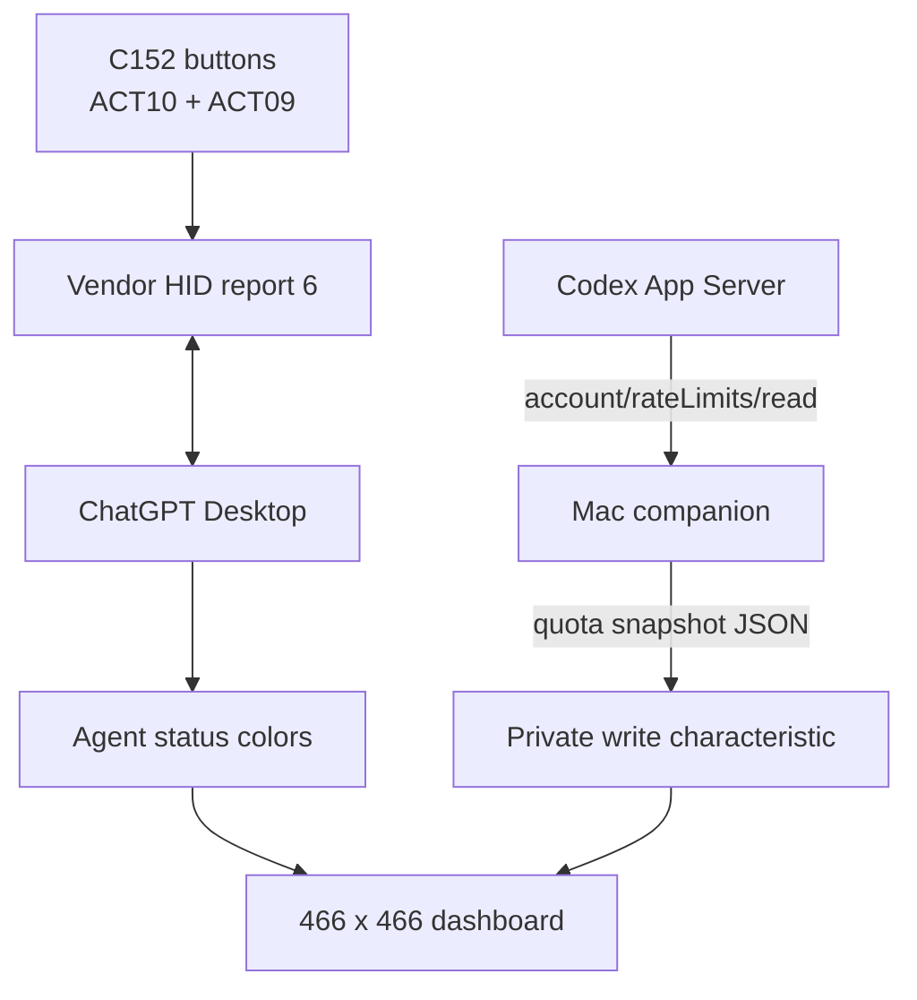

# Architecture

## Decision

Use two BLE services on one ESP32-S3 connection:

1. **Codex Micro-compatible HID over GATT** for native ChatGPT Desktop
   detection, Agent status, button mappings, and voice actions.
2. **Private quota GATT service** for a local Mac companion to write a compact
   rate-limit snapshot.

This split is necessary because the observed Codex Micro protocol has no
account quota or reset method.

## Trust boundary

- ChatGPT Desktop owns all first-party device actions and microphone behavior.
- The companion owns Codex App Server startup, local authentication inheritance,
  polling, reset-time conversion, and CoreBluetooth writes.
- Firmware owns rendering, button events, BLE reconnection, and transient quota
  state.
- Firmware stores no OpenAI token and makes no OpenAI network request.

## Voice boundary

The StopWatch's ES8311 microphone and speaker are real hardware, but they are
not part of the Codex Micro control protocol. Version 1 deliberately uses the
Mac microphone, matching the original Codex Micro behavior. Streaming the
watch microphone would require an independent USB Audio, BLE audio, or custom
compressed-audio design and should not be conflated with protocol compatibility.

The left button uses Mic key `ACT10`. The tested ChatGPT Desktop layout exposed
only one Mic-key assignment, so the right button uses configurable Command Key 4
(`ACT09`) and is assigned to Toggle voice chat on the host.

## Failure modes

- ChatGPT update rejects the emulated identity or changes RPC behavior.
- macOS caches an old HID descriptor; forget/re-pair is required.
- HID plus custom 128-bit service exceeds an advertising payload assumption.
- CoreBluetooth cannot reliably rediscover the private service while HOGP is
  connected.
- Companion stops updating; the UI marks data stale after three minutes.
- Reset countdown reaches zero before a refreshed snapshot arrives.
