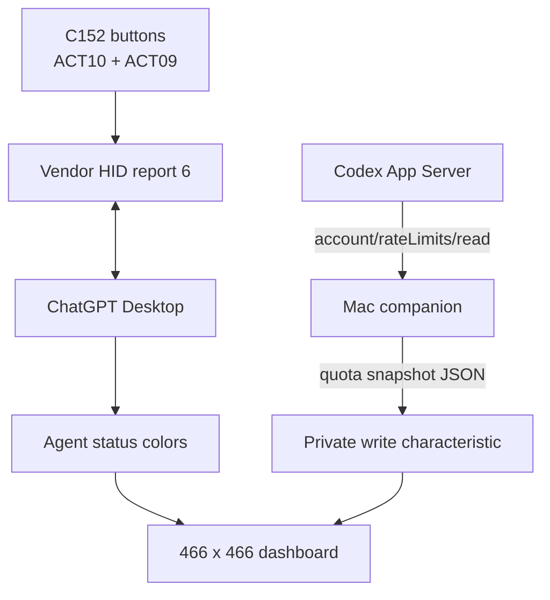

# Architecture

## Decision

Use two BLE services on one ESP32-S3 connection:

1. **Codex Micro-compatible HID over GATT** for native ChatGPT Desktop
   detection, Agent status, button mappings, and voice actions.
2. **Private quota GATT service** for a local Mac companion to write a compact
   rate-limit snapshot.

This split is necessary because the observed Codex Micro protocol has no
account quota or reset method.

## Trust boundary

- ChatGPT Desktop owns all first-party device actions and microphone behavior.
- The companion owns Codex App Server startup, local authentication inheritance,
  polling, reset-time conversion, and CoreBluetooth writes.
- Firmware owns rendering, button events, BLE reconnection, and transient quota
  state.
- Firmware stores no OpenAI token and makes no OpenAI network request.

## Voice boundary

The default build uses the Mac microphone. The optional
`usb-mic` build exposes the StopWatch ES8311/MEMS capture path
as a standard USB Audio Class mono input. That path is independent of Codex
Micro compatibility: Bluetooth still carries control events, USB carries only
microphone PCM, and no speaker interface is present.

The left button uses Mic key `ACT10`. The tested ChatGPT Desktop layout exposed
only one Mic-key assignment, so the right button uses configurable Command Key 4
(`ACT09`) and is assigned to Toggle voice chat on the host.

## Health model

Connection and quota freshness are deliberately independent:

- `OFFLINE`: no BLE GATT connection;
- `BLE ONLY`: at least one BLE connection, but no recent complete host HID RPC;
- `CODEX LIVE`: a supported host RPC with a valid parameter shape was handled
  during the current connection epoch within the last five minutes;
- `SYNC STALE`: no accepted quota write arrived within three minutes. This can
  appear at the same time as `CODEX LIVE`.

Only a supported, successfully handled HID RPC with a valid parameter shape
proves Codex host activity. Unknown methods, malformed parameters, outgoing
keys, raw fragments, the quota companion, and a generic BLE connection do not
promote the link to `CODEX LIVE`.

## Power lifecycle

The default wireless image has four display/power states:

1. active;
2. dimmed;
3. desk sleep, with the CO5300 put to sleep and the shared AMOLED/audio/motor
   L3B rail disabled while the ESP32 and BLE continue running;
4. Travel Mode, using M5PM1 shutdown so BLE and Agent alerts stop completely.

The pinned M5GFX framebuffer wrapper did not forward physical AMOLED sleep or
repeat initialization. `scripts/patch_m5gfx_amoled_sleep.py` applies a narrow,
checked build-time patch so the controller is put to sleep before G8 is cut and
can replay its initialization sequence after G8/G5 power-reset recovery.

USB input voltage selects Dock Mode: battery policy dims/sleeps after 2/5
minutes, while Dock Mode uses 10/30 minutes. The optional USB-mic image cannot
remove L3B without also losing its microphone, so it keeps the rail on and uses
brightness-only desk sleep. A short red-power-button click toggles desk sleep; a
fast double-click runs the clean Travel shutdown path. The firmware disables
PM1's immediate double-click cut so it can release HID controls and show the
offline warning first. A six-second center-dial hold provides a slower fallback.
The red button's hardware long-hold download path remains available for
recovery. This release relies on the PM1 power button or VIN
insertion for cold wake; no IMU or scheduled RTC wake is configured.

## Failure modes

- ChatGPT update rejects the emulated identity or changes RPC behavior.
- macOS caches an old HID descriptor; forget/re-pair is required.
- HID plus custom 128-bit service exceeds an advertising payload assumption.
- CoreBluetooth cannot reliably rediscover the private service while HOGP is
  connected.
- Companion stops updating; the UI marks data stale after three minutes.
- Reset countdown reaches zero before a refreshed snapshot arrives.
- A future M5GFX source change no longer matches the checked AMOLED patch; the
  build fails instead of silently producing brightness-only sleep.
